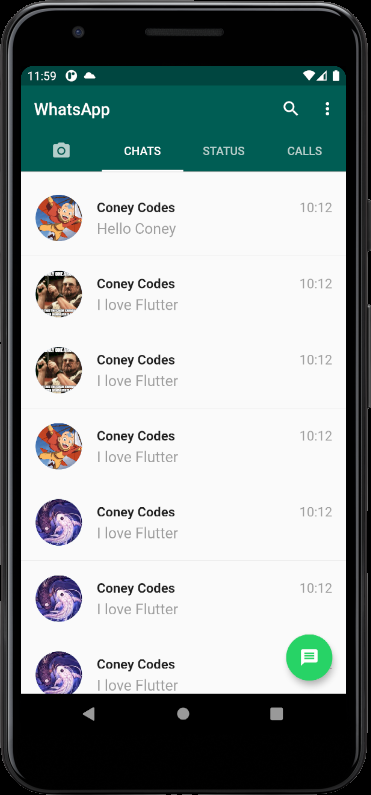
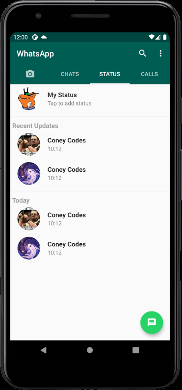
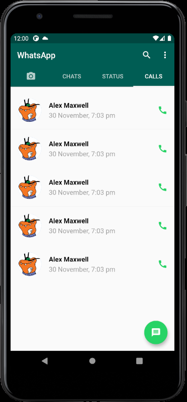
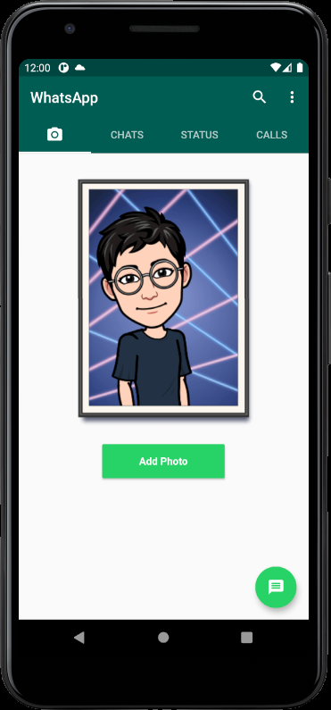

# WhatsApp UI Clone
 
       

A Flutter Project on Whatsapp UI Clone, 

### 👉 If you like this repo then please give it a ⭐️

## Screenshots
    

## Tech Stack
- Flutter
- Dart

## NOTE:
This project is subject to change by the developer and is still in development
## How to run this
Running this is as simple as it gets. Follow this steps
1. Open your terminal (NOTE: git bash prefered/ Terminal on VS Code)
2. Navigate to the project folder where you have cloned this repo.
3. Open an emulator or plug in a real device
4. Type the following command in the terminal 
     flutter run
     
## Pull Request
Pull Requests are welcome. Please follow these rules for the ease of understanding:
* Make sure to check for available issues before raising one
* Give me a maximum of 24-48 hours to respond
* Have proper documentation on the parts you are changing/adding

